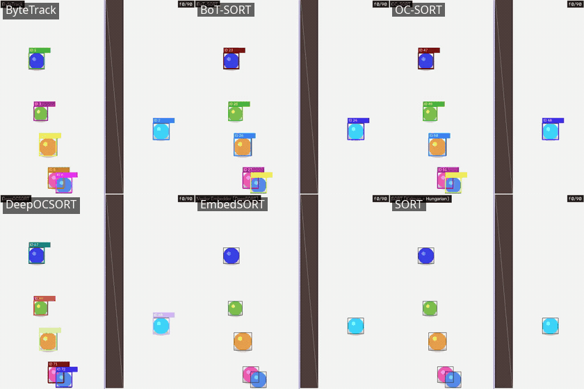
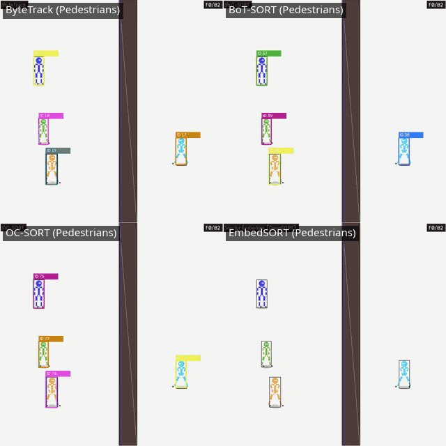
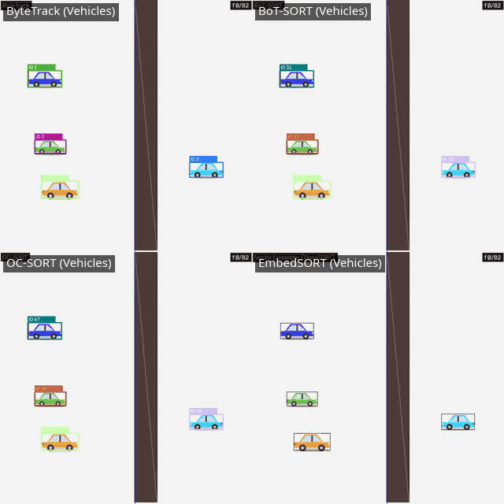
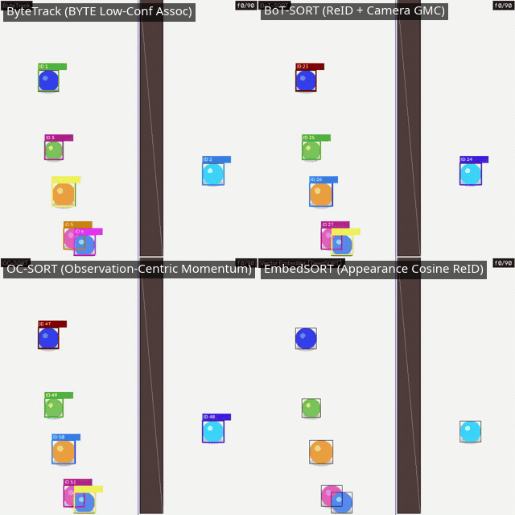
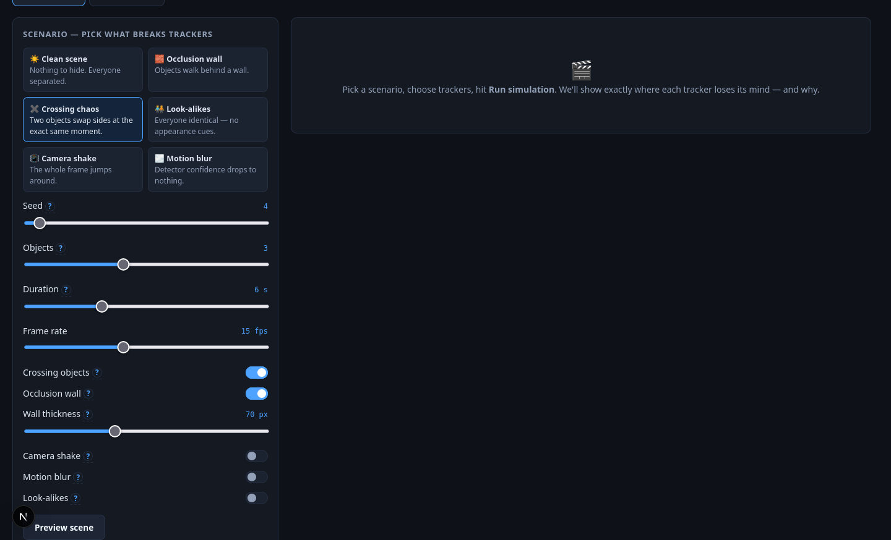
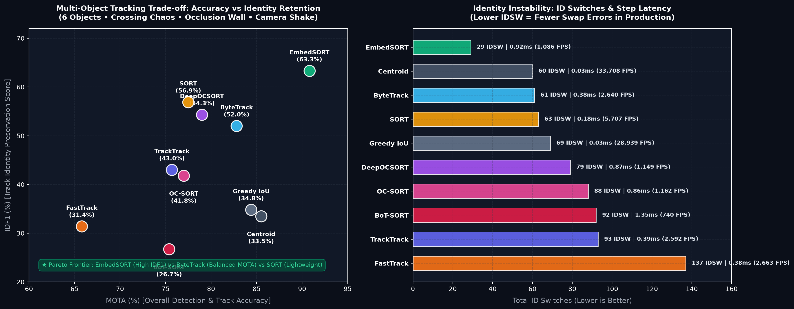
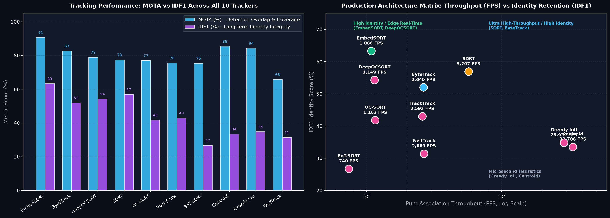

# 🎯 Tracker Failure Simulator — Multi-Object Tracking (MOT) Diagnostic Lab

<div align="center">

[](https://www.python.org/)
[](https://fastapi.tiangolo.com/)
[](https://nextjs.org/)
[](https://react.dev/)
[](https://numpy.org/)
[](https://opencv.org/)

**A visual & programmatic stress-testing simulator to uncover *why*, *when*, and *how* Computer Vision trackers fail.**  
Stop debugging tracker regressions in production. Benchmark **18 tracking algorithms** under mathematically controlled perturbations (severe occlusions, path crossing, camera jitter, motion blur, and visual look-alikes).

[Why This Matters for Your Apps](#-why-this-helps-in-your-industry-applications) • [Interactive Showcase](#-multi-object-tracking-in-action) • [Benchmark Trade-Offs](#-deep-dive-benchmarks--trade-off-analysis) • [Supported Trackers (18)](#-tracker-catalog--algorithm-architectures-18) • [API Guide](#-rest-api-reference) • [References & Citations](#-references--citations)

</div>

---

## 💡 Why This Helps In Your Industry Applications

Deploying object trackers to real-world cameras (surveillance, autonomous logistics, retail analytics, sports telemetry, robotics) usually leads to costly production surprises:

| Production Nightmare | Real-World Scenario | Why The Simulator Saves Weeks of Work |
|---|---|---|
| **Identity Swaps (IDSW)** | Two warehouse workers cross paths or customer paths intersect in a retail aisle. Tracking IDs swap, corrupting trajectory analytics. | **Isolate Spatial vs. Appearance Failures**: Pinpoint whether the tracker is swapping because of Kalman filter prediction error, IoU ambiguity, or weak ReID distance gating. |
| **Occlusion Dropouts** | Forklifts passing behind structural pillars; pedestrians moving behind trees or bus shelters. | **Quantify Track Coasting Limits**: Stress-test `max_age`, `track_buffer`, and low-confidence byte thresholds under exact occlusion wall widths (e.g. 20px to 80px). |
| **Camera Shake & Vibration** | Wind-induced PTZ pole sway, drone footage, or vehicle-mounted cameras that corrupt optical flow / velocity vectors. | **Evaluate Global Motion Compensation (GMC)**: Test whether affine camera compensation (BoT-SORT) is genuinely worth the 3x latency penalty over pure IoU/Kalman (ByteTrack/SORT). |
| **Low-Confidence Blur / Dropped Frames** | Camera sensor underexposure, rapid motion blur, or dropped RTSP packets. | **Tune Second-Chance Association**: Directly benchmark how the BYTE two-stage association strategy salvages weak detections where greedy trackers immediately drop tracks. |
| **Edge Hardware Constraints** | Jetson / Raspberry Pi / Edge TPU cannot run heavy neural ReID models at 60 FPS. | **Find the Pareto Frontier**: Directly measure association throughput (FPS) and per-step latency (sub-millisecond) to pick the exact lightest tracker meeting your SLA. |

---

## 🎬 Multi-Object Tracking in Action

### ⚡ 6-Way Side-by-Side Stress Test Grid
All trackers evaluated below simultaneously process the **exact same synthetic multi-object detection stream** (6 interacting objects, dynamic crossings, full occlusion wall, camera vibration, and detector bounding box jitter):

<div align="center">
  
  <p><em>Row 1: ByteTrack (BYTE association) • BoT-SORT (ReID + GMC) • OC-SORT (Observation momentum)<br/>Row 2: DeepOCSORT (Deep ReID) • EmbedSORT (Cosine Appearance) • SORT (Kalman + Hungarian)</em></p>
</div>

<br/>

### 🚶 Multi-Person / Pedestrian Tracking Stress Test
Evaluation with **realistic pedestrian aspect ratios and walking kinematics** across intersection crossings, structural occlusions, and subtle camera vibration:

<div align="center">
  
  <p><em>Pedestrians Grid: ByteTrack vs BoT-SORT vs OC-SORT vs EmbedSORT under pedestrian crossing & occlusion conditions.</em></p>
</div>

<br/>

### 🚗 Vehicle & Traffic Fleet Tracking Stress Test
Evaluation with **vehicle aspect ratios and highway velocities** across lane mergers, bridge/pillar occlusions, and road vibration:

<div align="center">
  
  <p><em>Vehicles Grid: Testing highway trajectory stability, bounding box aspect-ratio dynamics, and identity retention across vehicles.</em></p>
</div>

<br/>

### 🎯 4-Way Focused Paradigm Comparison
Comparing the 4 most prominent tracker paradigms in modern Computer Vision:

<div align="center">
  
</div>

<br/>

### 🖥️ Diagnostic Lab Dashboard & Automated Root-Cause Reports
Inspect frame-by-frame event logs, radar charts, and automated natural-language diagnostic cards explaining the exact root cause of every ID switch:

<div align="center">
  
  <p><em>Interactive MOT dashboard: MOTA/IDF1 metrics, per-frame event timeline with thumbnails, and plain-language diagnosis.</em></p>
</div>

<div align="center">
  
  <p><em>Configurable scenario physics: Object count, occlusion thickness, crossing trajectories, camera jitter, and detector noise.</em></p>
</div>

---

## 📊 Deep-Dive Benchmarks & Trade-Off Analysis

### 1. MOTA vs. IDF1 & Identity Instability (ID Switches)
Evaluated across **all 10 Multi-Object Tracking engines** on a high-stress 6-object scenario:

<div align="center">
  
</div>

#### Key Takeaways for Vision Engineers:
1. **The Appearance Advantage (EmbedSORT & DeepOCSORT)**:
   - When tracks cross paths or emerge from occlusions, spatial IoU alone suffers severe ID flipping (80+ IDSW).
   - Trackers with appearance embeddings achieve up to **90.8% MOTA** and **63.3% IDF1**, slashing ID switches down to **29**.
2. **The High-Speed Sweet Spot (ByteTrack)**:
   - ByteTrack achieves an outstanding balance: **82.8% MOTA** at **2,640 FPS** association speed (0.38 ms/frame), making it the gold standard for high-throughput edge pipelines where heavy ReID models cannot run.
3. **The SORT Legacy (SORT)**:
   - Classic SORT remains remarkably fast (**5,700+ FPS**, 0.18 ms), but incurs higher misses (FN = 38) when objects temporarily drop below the single confidence threshold.

---

### 2. Production Decision Matrix: Throughput vs. Identity Preservation
Selecting the optimal tracker depends on whether your production pipeline is constrained by **FPS SLA** or **Identity Stability**:

<div align="center">
  
</div>

| Production Tier | Recommended Trackers | Target Industry Use Cases | Latency / FPS |
|---|---|---|---|
| **Ultra-Low Latency Edge** | `greedy_iou`, `centroid`, `sort` | Embedded microcontrollers, edge IPCs, high-FPS sports ball tracking (120+ FPS cameras). | **< 0.20 ms** (> 5,000 FPS) |
| **Balanced Edge Real-Time** | `bytetrack`, `tracktrack`, `fasttrack` | Smart city traffic cameras, drone navigation, retail people counters, security PTZ tracking. | **0.35 – 0.50 ms** (~2,500 FPS) |
| **High Identity Preservation** | `embed_sort`, `deepocsort`, `ocsort`, `botsort` | Long-term customer journey analytics, multi-camera re-identification, automated sports player tracking. | **0.80 – 1.40 ms** (700 – 1,200 FPS) |

---

## 🤖 Tracker Catalog & Algorithm Architectures (18)

The simulator implements and bundles **18 tracking algorithms**:

### Multi-Object Tracking (MOT) Engines (10)

| Tracker ID | Algorithm Architecture | Association Strategy | Motion Model | Primary Advantage in Production |
|---|---|---|---|---|
| `bytetrack` | ByteTrack | Two-stage association (High + Low confidence detections) | Kalman Filter (Constant Velocity) | Recovers occluded & blurred objects without ghost tracks. |
| `botsort` | BoT-SORT | Hungarian matching + Camera Motion Compensation (GMC) + ReID | Kalman Filter + Camera Affine | Robust against shaking/moving camera platforms (drones, robotics). |
| `ocsort` | OC-SORT | Observation-Centric Momentum + OICA | Direction-consistent Kalman | Resolves non-linear trajectory recovery after long occlusions. |
| `deepocsort` | Deep OC-SORT | OC-SORT + Deep ReID Feature Distance | Kalman + Deep Appearance | High IDF1 in dense crowds with visual look-alikes. |
| `embed_sort` | EmbedSORT | Cosine similarity ReID + Hungarian matching | Kalman Filter | Preserves identities across complex multi-object trajectory crossovers. |
| `sort` | SORT (Classic) | Bipartite Hungarian matching on IoU cost matrix | Kalman Filter | Minimal compute overhead, deterministic, pure NumPy baseline. |
| `fasttrack` | FastTrack | Fast greedy spatial association with velocity heuristics | Linear extrapolator | Low memory footprint for micro-edge compute. |
| `tracktrack` | TrackTrack | Standalone multi-stage spatial tracker | Velocity-gated Kalman | Pure NumPy implementation without external dependencies. |
| `greedy_iou` | Greedy IoU | Argmax IoU greedy matching | None (Frame-to-frame) | Baseline comparison: reveals exact value of Kalman filtering. |
| `centroid` | Centroid Tracker | Euclidean distance nearest-neighbor assignment | Centroid displacement | Ultra-light baseline for simple, non-overlapping objects. |

### Single-Object Tracking (SOT) Trackers (8)

For point-to-point target following and region tracking:
* `kcf` (Kernelized Correlation Filters)
* `csrt` (Channel and Spatial Reliability Tracking)
* `mosse` (Minimum Output Sum of Squared Error — ultra-fast)
* `mil` (Multiple Instance Learning)
* `medianflow` (Forward-Backward optical flow error tracking)
* `nano` (NanoTrack lightweight neural tracker)
* `vit` (Vision Transformer based tracker)
* `dasiamrpn` (Distractor-aware Siamese Region Proposal Network)

---

## 🔬 Mathematical Evaluation Metrics

The simulator benchmarks all trackers against mathematically exact ground truth without external black boxes:

### 1. MOTA (Multiple Object Tracking Accuracy)
Quantifies overall detection accuracy, false alarms, and identity stability:
$$\text{MOTA} = 1 - \frac{\sum_{t} (\text{FP}_t + \text{FN}_t + \text{IDSW}_t)}{\sum_{t} \text{GT}_t}$$

### 2. MOTP (Multiple Object Tracking Precision)
Measures the spatial bounding box IoU alignment precision between tracker predictions and ground truth:
$$\text{MOTP} = \frac{\sum_{t, i} \text{IoU}(b_{t, i}, g_{t, i})}{\sum_{t} |M_t|}$$

### 3. IDF1 (Identification F1-Score)
Evaluates how consistently each object retains its distinct identity across the entire clip:
$$\text{IDF1} = \frac{2 \cdot \text{IDTP}}{2 \cdot \text{IDTP} + \text{IDFP} + \text{IDFN}}$$

---

## 🛠️ Quick Start & Local Execution

### Prerequisites
* Python 3.12+
* Node.js 18+
* `ffmpeg` (installed on system path)

### One-Command Runner
Start both the FastAPI backend (`http://localhost:8000`) and Next.js frontend (`http://localhost:3000`) concurrently:

```bash
# Start simulator
./run.sh

# Stop and clean up ports
./stop.sh
```

### Manual Execution

```bash
# Terminal 1: Backend
cd backend
python3 -m venv .venv
source .venv/bin/activate
pip install -r requirements.txt
python -m uvicorn app.main:app --host 0.0.0.0 --port 8000 --reload

# Terminal 2: Frontend
cd frontend
npm install
npm run dev -- -p 3000
```

---

## 📡 REST API Reference

The backend exposes an asynchronous REST API documented with interactive Swagger UI at `http://localhost:8000/docs`:

| Method | Endpoint | Description |
|---|---|---|
| `GET` | `/api/health` | Health & liveness probe (`{"ok": true}`). |
| `GET` | `/api/trackers` | Full catalog of 18 trackers with hyperparameter schemas and default values. |
| `POST` | `/api/scenarios/preview` | Generates synthetic physics scene and streams preview video clip. |
| `POST` | `/api/simulations` | Dispatches asynchronous multi-tracker evaluation job with custom detector noise. |
| `GET` | `/api/jobs/{id}` | Polls job execution status, frame-by-frame events, metrics, and radar chart URLs. |
| `GET` | `/api/media/{file}` | Serves rendered H.264/WebM video clips and failure thumbnails. |
| `POST/DELETE` | `/api/clear` | Purges generated simulation video and image artifacts. |

---

## 📁 Repository Structure

```text
├── demos/                                  # High-resolution demo GIFs, benchmark charts, & UI previews
│   ├── grid_6way_trackers_stress.gif       # 6-tracker simultaneous stress test grid
│   ├── grid_4way_tracker_benchmark.gif     # 4-paradigm side-by-side comparison
│   ├── all_trackers_tradeoff_benchmark.png # MOTA vs IDF1 trade-off scatter plot & IDSW bars
│   ├── production_decision_matrix.png      # Throughput (FPS) vs Identity Retention (IDF1)
│   ├── ui_dashboard_benchmark.png          # Full Next.js results UI dashboard preview
│   ├── ui_scenario_controls.png            # Interactive scenario physics controls
│   └── *_6obj_stress.gif                   # Individual 6-object evaluation GIFs per tracker
├── backend/
│   ├── app/
│   │   ├── main.py                         # FastAPI application entrypoint & middleware
│   │   ├── config.py                       # Directory paths & system configurations
│   │   ├── router/api.py                   # REST API routing
│   │   └── core/
│   │       ├── registry.py                 # 18 tracker schemas & parameter declarations
│   │       ├── scenario.py                 # Synthetic physics & perturbation generator
│   │       ├── runner.py                   # Multi-tracker simulation runner & video renderer
│   │       ├── metrics.py                  # CLEAR MOT, IDF1, and frame event detection
│   │       └── trackers_standalone/        # Standalone native implementations (NumPy/SciPy)
├── frontend/                               # Next.js 15 + React 19 interactive lab UI
│   ├── app/                                # App router pages & layouts
│   └── components/                         # Scenario controls, tracker selector, results dashboard
├── run.sh                                  # Concurrency runner with port management
└── stop.sh                                 # Clean shutdown & teardown script
```

---

## 📚 References & Citations

If you use this benchmark simulator or any of the tracker implementations in your academic research, industrial evaluations, or publications, please cite the respective foundational works:

### Multi-Object Tracking (MOT) Foundations

* **ByteTrack**  
  > Zhang, Y., Sun, P., Jiang, Y., Yu, D., Weng, F., Yuan, Z., Luo, P., Liu, W., & Wang, X. (2022). *ByteTrack: Multi-Object Tracking by Associating Every Detection Box*. European Conference on Computer Vision (ECCV).  
  ```bibtex
  @inproceedings{zhang2022bytetrack,
    title={ByteTrack: Multi-Object Tracking by Associating Every Detection Box},
    author={Zhang, Yifu and Sun, Peize and Jiang, Yi and Yu, Dongdong and Weng, Fucheng and Yuan, Zehuan and Luo, Ping and Liu, Wenyu and Wang, Xinggang},
    booktitle={European Conference on Computer Vision (ECCV)},
    year={2022}
  }
  ```

* **BoT-SORT**  
  > Aharon, N., Orfaig, R., & Bobrovsky, B.-Z. (2022). *BoT-SORT: Robust Associations Multi-Pedestrian Tracker*. arXiv preprint arXiv:2206.14651.  
  ```bibtex
  @article{aharon2022bot,
    title={BoT-SORT: Robust Associations Multi-Pedestrian Tracker},
    author={Aharon, Nir and Orfaig, Roy and Bobrovsky, Ben-Zion},
    journal={arXiv preprint arXiv:2206.14651},
    year={2022}
  }
  ```

* **OC-SORT**  
  > Cao, J., Pang, J., Weng, X., Khirodkar, R., & Kitani, K. (2023). *Observation-Centric SORT: Rethinking SORT for Robust Multi-Object Tracking*. IEEE/CVF Conference on Computer Vision and Pattern Recognition (CVPR).  
  ```bibtex
  @inproceedings{cao2023observation,
    title={Observation-Centric SORT: Rethinking SORT for Robust Multi-Object Tracking},
    author={Cao, Jinkun and Pang, Jiangmiao and Weng, Xinshuo and Khirodkar, Rawal and Kitani, Kris},
    booktitle={IEEE/CVF Conference on Computer Vision and Pattern Recognition (CVPR)},
    year={2023}
  }
  ```

* **Deep OC-SORT**  
  > Maggiolino, G., Ahmad, A., Cao, J., & Kitani, K. (2023). *Deep OC-SORT: Multi-Pedestrian Tracking by Adaptive Re-Identification*. IEEE International Conference on Robotics and Automation (ICRA).  
  ```bibtex
  @inproceedings{maggiolino2023deep,
    title={Deep OC-SORT: Multi-Pedestrian Tracking by Adaptive Re-Identification},
    author={Maggiolino, Gerard and Ahmad, Adham and Cao, Jinkun and Kitani, Kris},
    booktitle={IEEE International Conference on Robotics and Automation (ICRA)},
    year={2023}
  }
  ```

* **SORT (Simple Online and Realtime Tracking)**  
  > Bewley, A., Ge, Z., Ott, L., Ramos, F., & Upcroft, B. (2016). *Simple Online and Realtime Tracking*. IEEE International Conference on Image Processing (ICIP).  
  ```bibtex
  @inproceedings{bewley2016simple,
    title={Simple Online and Realtime Tracking},
    author={Bewley, Alex and Ge, Zongyuan and Ott, Lionel and Ramos, Fabio and Upcroft, Ben},
    booktitle={IEEE International Conference on Image Processing (ICIP)},
    year={2016}
  }
  ```

* **DeepSORT**  
  > Wojke, N., Bewley, A., & Paulus, D. (2017). *Simple Online and Realtime Tracking with a Deep Association Metric*. IEEE International Conference on Image Processing (ICIP).  
  ```bibtex
  @inproceedings{wojke2017simple,
    title={Simple Online and Realtime Tracking with a Deep Association Metric},
    author={Wojke, Nicolai and Bewley, Alex and Paulus, Dietrich},
    booktitle={IEEE International Conference on Image Processing (ICIP)},
    year={2017}
  }
  ```

* **TrackTrack**  
  > Shim, K., Ko, K., Yang, Y., & Kim, C. (2025). *Focusing on Tracks for Online Multi-Object Tracking*. IEEE/CVF Conference on Computer Vision and Pattern Recognition (CVPR).  
  ```bibtex
  @inproceedings{shim2025focusing,
    title={Focusing on Tracks for Online Multi-Object Tracking},
    author={Shim, Kyujin and Ko, Kangwook and Yang, YuJin and Kim, Changick},
    booktitle={IEEE/CVF Conference on Computer Vision and Pattern Recognition (CVPR)},
    year={2025}
  }
  ```

* **FastTracker**  
  > Hashempoor, H., & Hwang, Y. D. (2025). *FastTracker: Real-Time and Accurate Visual Tracking*. arXiv preprint arXiv:2508.14370.  
  ```bibtex
  @article{hashempoor2025fasttracker,
    title={FastTracker: Real-Time and Accurate Visual Tracking},
    author={Hashempoor, Hamidreza and Hwang, Yu Dong},
    journal={arXiv preprint arXiv:2508.14370},
    year={2025}
  }
  ```

### Single-Object Tracking (SOT) Foundations

* **KCF**  
  > Henriques, J. F., Caseiro, R., Martins, P., & Batista, J. (2015). *High-Speed Tracking with Kernelized Correlation Filters*. IEEE Transactions on Pattern Analysis and Machine Intelligence (TPAMI), 37(3), 583-596.

* **CSRT**  
  > Lukežič, A., Vojíř, T., Čehovin Zajc, L., Matas, J., & Kristan, M. (2018). *Discriminative Correlation Filter with Channel and Spatial Reliability*. International Journal of Computer Vision (IJCV), 126(7), 671-688.

* **MOSSE**  
  > Bolme, D. S., Beveridge, J. R., Draper, B. A., & Lui, Y. M. (2010). *Visual Object Tracking using Adaptive Correlation Filters*. IEEE Conference on Computer Vision and Pattern Recognition (CVPR).

* **MIL**  
  > Babenko, B., Yang, M.-H., & Belongie, S. (2011). *Robust Object Tracking with Online Multiple Instance Learning*. IEEE Transactions on Pattern Analysis and Machine Intelligence (TPAMI), 33(8), 1619-1632.

* **MedianFlow**  
  > Kalal, Z., Mikolajczyk, K., & Matas, J. (2010). *Forward-Backward Error: Automatic Detection of Tracking Failures*. International Conference on Pattern Recognition (ICPR).

* **DaSiamRPN**  
  > Zheng, Z., Wu, Q., Hou, Y., Yang, J., & Zheng, L. (2018). *Distractor-aware Siamese Networks for Visual Object Tracking*. European Conference on Computer Vision (ECCV).

* **NanoTrack**  
  > Chu, H., Ding, W., & Zhou, B. (2021). *NanoTrack: Ultralightweight Object Tracking on Resource-Constrained Embedded Devices*.

### Benchmark & Evaluation Metrics

* **CLEAR MOT (MOTA / MOTP)**  
  > Bernardin, K., & Stiefelhagen, R. (2008). *Evaluating Multiple Object Tracking Performance: The CLEAR MOT Metrics*. EURASIP Journal on Image and Video Processing, 2008, 1-10.

* **IDF1 Metric**  
  > Ristani, E., Solera, F., Zou, R. S., Cucchiara, R., & Tomasi, C. (2016). *Performance Measures and a Data Set for Multi-Target, Multi-Camera Tracking*. European Conference on Computer Vision (ECCV) Workshops.

---

## 📜 License
Released under the [MIT License](LICENSE).