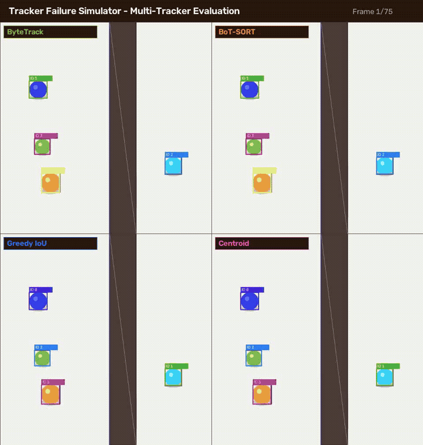
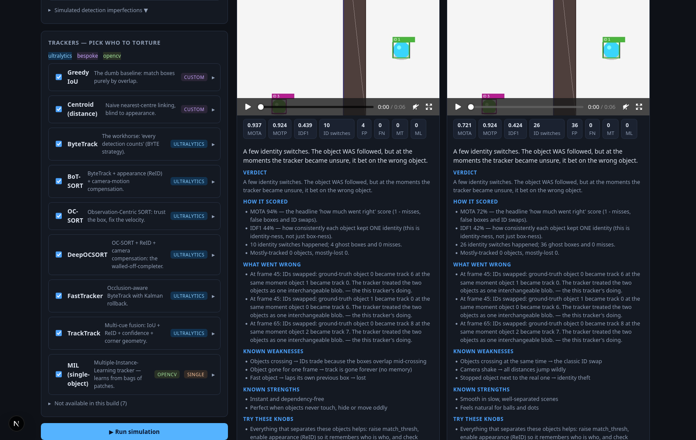

# 🎯 Tracker Failure Simulator

<div align="center">

[](https://www.python.org/)
[](https://fastapi.tiangolo.com/)
[](https://nextjs.org/)
[](https://react.dev/)
[](https://opencv.org/)
[](https://github.com/ultralytics/ultralytics)

**An interactive visual lab to discover *why* and *how* multi-object trackers fail.**  
Stress-test **17 object trackers** against occlusion, crossing paths, motion blur, camera shake, and look-alikes. Inspect granular failure reports, ID switches, and side-by-side MOT benchmarks in real time.

[Quick Start](#-quick-start) • [Live Demo](#-demo) • [Supported Trackers](#-trackers-catalog-17) • [API Reference](#-api-endpoints) • [Teardown](#-stopping-the-services)

</div>

---

## 🎬 Demo

### ⚡ Side-by-Side Tracker Evaluation
Watch how different tracking paradigms (**ByteTrack**, **BoT-SORT**, **Greedy IoU**, and **Centroid**) behave under challenging occlusions:

<div align="center">
  
</div>

<br/>

### 🖥️ Lab Dashboard & Report Card
Tune synthetic scene parameters, configure hyperparameter knobs with tooltips, and review automated natural-language report cards explaining every ID switch and fumble:

<div align="center">
  
  <p><em>Comprehensive multi-tracker performance reports, event timelines, and side-by-side MOTA comparisons.</em></p>
</div>

<div align="center">
  
  <p><em>Interactive scenario generator: Crossing objects, occlusion wall, camera shake, motion blur, and detector noise.</em></p>
</div>

---

## ✨ Features

- **🎮 Dual Operation Modes**:
  - **Synthetic Simulator** — Generate ground-truth physics scenes with deterministic seed reproducibility. Every track is graded precisely with ground-truth metrics.
  - **Real Video Mode** — Upload any MP4 video; YOLO detects objects, you select the tracker, and the system highlights heuristic ID switches and trajectory losses.
- **🌪️ Engineered Failure Scenarios**:
  - **Occlusion Wall**: Objects disappear behind barriers of adjustable thickness.
  - **Crossing Chaos**: Swap trajectories and evaluate ID swap vulnerabilities.
  - **Camera Shake**: Random affine frame translations to test global motion compensation (GMC).
  - **Motion Blur**: Gaussian blur kernels that degrade detector confidence.
  - **Look-alikes**: Eliminate color variance to stress spatial/appearance association.
- **📊 Scientific Metrics & Explainable Reports**:
  - Full MOT evaluation: **MOTA**, **MOTP**, **IDF1**, **IDP**, **IDR**, **IDSW**, **False Positives**, **Misses**, **Latency (ms)**, and **FPS**.
  - Natural-language diagnosis: Plain-language explanations of failure root causes with actionable parameter recommendations.
  - Interactive multi-tracker comparison charts with trade-off analysis (Accuracy vs Latency vs Error Burden).
  - Clickable event timeline with frame-accurate thumbnail previews and video seeking.

---

## 📐 Evaluation Metrics & Mathematical Formulas

The simulator evaluates all trackers rigorously against frame-accurate ground truth without black-box dependencies.

### 1. MOTA (Multiple Object Tracking Accuracy)
Measures the overall tracking coverage and detection accuracy across all frames:

$$\text{MOTA} = 1 - \frac{\sum_{t} (\text{FP}_t + \text{FN}_t + \text{IDSW}_t)}{\sum_{t} \text{GT}_t}$$

* **$\text{FP}_t$ (False Positives / Ghosts)**: Detections or tracks created by the tracker where no real object exists.
* **$\text{FN}_t$ (False Negatives / Misses)**: Ground-truth objects that the tracker failed to detect or track.
* **$\text{IDSW}_t$ (ID Switches)**: Times an active track identity swapped to a different object.
* **$\text{GT}_t$**: Total visible ground-truth objects at frame $t$.

---

### 2. MOTP (Multiple Object Tracking Precision)
Measures the spatial bounding box overlap precision between matched tracks and ground truth:

$$\text{MOTP} = \frac{\sum_{t, i} \text{IoU}(b_{t, i}, g_{t, i})}{\sum_{t} |M_t|}$$

Where $\text{IoU}(b, g) = \frac{\text{Area}(b \cap g)}{\text{Area}(b \cup g)}$ and $|M_t|$ is the number of matched pairs at frame $t$.

---

### 3. IDF1 (Identification F1 Score)
Measures global trajectory identity preservation over the entire sequence by computing the optimal global bipartite matching between ground-truth trajectories and predicted tracks:

$$\text{IDF1} = \frac{2 \cdot \text{IDTP}}{2 \cdot \text{IDTP} + \text{IDFP} + \text{IDFN}}$$

Where:
* **$\text{IDTP}$ (ID True Positives)**: Frames where the object is tracked with its globally assigned primary track ID.
* **$\text{IDFN}$ (ID False Negatives)**: Frames where the object is missed or assigned to the wrong track ID.
* **$\text{IDFP}$ (ID False Positives)**: Frames where the track ID is assigned to the wrong object or empty space.

Related Identification Metrics:
* **$\text{ID Precision (IDP)}$**: $\text{IDP} = \frac{\text{IDTP}}{\text{IDTP} + \text{IDFP}}$
* **$\text{ID Recall (IDR)}$**: $\text{IDR} = \frac{\text{IDTP}}{\text{IDTP} + \text{IDFN}}$

---

### 4. Speed & Latency Benchmarks
* **Average Latency**: Average per-frame execution time of the tracker engine update:
  $$\text{Latency} = \frac{1}{T} \sum_{t=1}^{T} \Delta t_{\text{update}} \quad (\text{ms/frame})$$
* **Throughput (FPS)**: Effective tracking speed:
  $$\text{FPS} = \frac{1000}{\text{Average Latency (ms)}}$$

---

### 5. ⚖️ Interactive Trade-off Analysis (Accuracy vs Latency vs Errors)
The built-in multi-tracker comparison chart evaluates algorithm efficiency across three dimensions:
* **Vertical Axis ($Y$)**: MOTA Accuracy percentage ($0\% \to 100\%$, higher is better).
* **Horizontal Axis ($X$)**: Average per-frame latency in ms (supports both **Logarithmic** and **Linear** scales, lower is faster).
* **Bubble Radius (Size)**: Total error burden $\text{Radius} \propto \text{FP} + \text{FN} + \text{IDSW}$. A compact bubble denotes a clean, resilient tracking run; a large bubble highlights heavy track fragmentation.
* **★ Sweet Spot (Top-Left Quadrant)**: High MOTA Accuracy paired with sub-millisecond execution latency.

---

## 🚀 Quick Start

Run both backend and frontend concurrently with a single command:

```bash
./run.sh
# or
./start.sh
```

- **Frontend Dashboard**: [http://localhost:3000](http://localhost:3000)
- **Backend Swagger API**: [http://localhost:8000/docs](http://localhost:8000/docs)

*`run.sh` automatically checks/creates your Python virtual environment, installs missing dependencies, and frees ports if previously occupied.*

---

## 🛑 Stopping the Services

To shut down all running backend and frontend services and free ports `8000` & `3000`:

```bash
./stop.sh
# or
./down.sh
# or
./run.sh down
```

---

## 🛠️ Manual Execution

<details>
<summary><b>Click to expand individual manual launch commands</b></summary>

### Backend (FastAPI + Python 3.12)

```bash
cd backend
uv venv --python 3.12 .venv
uv pip install --python .venv/bin/python -r requirements.txt
.venv/bin/python -m uvicorn app.main:app --host 0.0.0.0 --port 8000 --reload
```

### Frontend (Next.js 15)

```bash
cd frontend
npm install
npm run dev -- -p 3000
```

</details>

---

## 🤖 Trackers Catalog (17)

| Engine | Trackers | Mode | Key Strengths & Vulnerabilities |
|---|---|---|---|
| **Ultralytics** | `bytetrack`, `botsort`, `ocsort`, `deepocsort`, `fasttrack`, `tracktrack` | Multi-Object | State-of-the-art MOT. BoT-SORT uses camera motion compensation (GMC) + ReID; ByteTrack recovers low-confidence detections; OC-SORT handles non-linear momentum. |
| **Custom Baselines** | `greedy_iou`, `centroid`, `sort` | Multi-Object | Implemented from scratch in pure NumPy/SciPy — no weights, no downloads, always available. Greedy IoU and centroid are the naive baselines; **SORT** adds a constant-velocity Kalman filter plus optimal Hungarian assignment, and is ByteTrack's parent. Compare it with ByteTrack to see exactly what the "second chance for weak detections" buys. |
| **OpenCV** | `mil`, `kcf`, `csrt`, `mosse`, `medianflow`, `nano`, `vit`, `dasiamrpn` | Single-Object | Classic vision trackers. High frame rates; susceptible to severe scale change and complete visual occlusion. |

> **Note**: Availability is automatically detected at startup. Unusable trackers in your current OpenCV build are disabled gracefully in the UI.

---

## 📡 API Endpoints

| Method | Endpoint | Purpose |
|---|---|---|
| `GET` | `/api/health` | Service liveness probe |
| `GET` | `/api/trackers` | Full tracker catalog, exposed hyperparameters, and host availability |
| `POST` | `/api/scenarios/preview` | Generate synthetic scenario and stream preview video |
| `POST` | `/api/simulations` | Dispatch asynchronous multi-tracker simulation job |
| `GET` | `/api/jobs/{id}` | Poll simulation job status and fetch complete report results |
| `POST` | `/api/real/upload` | Upload MP4 video clip for real-world tracking |
| `POST` | `/api/real/jobs` | Run YOLO detector + tracker pipeline on uploaded video |
| `GET` | `/api/media/{file}` | Serves H.264 video exports and event thumbnails |

---

## 📁 Repository Structure

```text
├── assets/                  # Demo GIF, UI snapshots, and promotional media
│   ├── demos.gif            # 4-way tracker comparison animated demonstration
│   ├── dashboard_results.png# Full results UI snapshot
│   └── snapshot.png         # Interactive scenario generator snapshot
├── backend/
│   ├── app/
│   │   ├── main.py          # FastAPI application & CORS setup
│   │   ├── config.py        # File storage & directory paths
│   │   ├── router/api.py    # REST API endpoints
│   │   └── core/
│   │       ├── registry.py  # 16 tracker configurations & hyperparameters
│   │       ├── trackers.py  # Engine wrappers (Ultralytics, OpenCV, Custom)
│   │       ├── scenario.py  # Synthetic physics & scene generator
│   │       ├── runner.py    # Simulation runner, video encoder, thumbnails
│   │       ├── metrics.py   # MOTA/MOTP/IDF1 & event detection engine
│   │       └── explainer.py # Graded natural-language report card engine
├── frontend/
│   ├── app/                 # Next.js App Router pages and global CSS
│   ├── components/          # Controls, tracker picker, results, compare table
│   └── lib/                 # API client and TypeScript definitions
├── run.sh                   # One-command startup script
├── stop.sh                  # One-command teardown script
└── docker-compose.yml       # Containerized deployment configuration
```

---

## 📜 License

Released under the [MIT License](LICENSE).