# 🎬 Tracker Failure Simulator — Demo Visuals

This directory contains visual demonstrations, benchmark charts, animated comparison grids, and individual tracker stress test recordings generated by the **Tracker Failure Simulator**.

All recordings run against the exact same synthetic detection streams generated by the simulator under controlled conditions (occlusions, trajectory crossovers, false alarms, missed detections, camera jitter, and bounding box noise).

---

## 🔲 Multi-Tracker Comparison Grids

Side-by-side synchronized comparison matrices showing multiple trackers handling identical frame feeds simultaneously:

| Asset | Preview | Description |
|---|---|---|
| [`grid_6way_trackers_stress.gif`](grid_6way_trackers_stress.gif) |  | **6-Way MOT Stress Grid**: High-density crossover & occlusion benchmark comparing `ByteTrack`, `BoT-SORT`, `OC-SORT` (Row 1) and `DeepOCSORT`, `EmbedSORT`, `SORT` (Row 2). |
| [`grid_4way_tracker_benchmark.gif`](grid_4way_tracker_benchmark.gif) |  | **4-Way MOT Comparison Grid**: Evaluates the 4 major tracker paradigms side-by-side under occlusion and path crossing. |
| [`grid_pedestrians_tracking.gif`](grid_pedestrians_tracking.gif) |  | **Pedestrian Fleet Multi-Grid**: Pedestrian-specific aspect ratios, walking dynamics, and intersection crossings evaluated across top trackers. |
| [`grid_cars_tracking.gif`](grid_cars_tracking.gif) |  | **Vehicle Fleet Multi-Grid**: Vehicle geometry and highway velocities across lane changes, merging, and structural occlusions. |

---

## 🔬 Single-Tracker Stress Tests (6-Object Scenario)

Isolated stress tests of individual trackers on a standardized 6-object crossing and occlusion scenario:

| Asset | Preview | Tracker & Architecture |
|---|---|---|
| [`bytetrack_6obj_stress.gif`](bytetrack_6obj_stress.gif) | 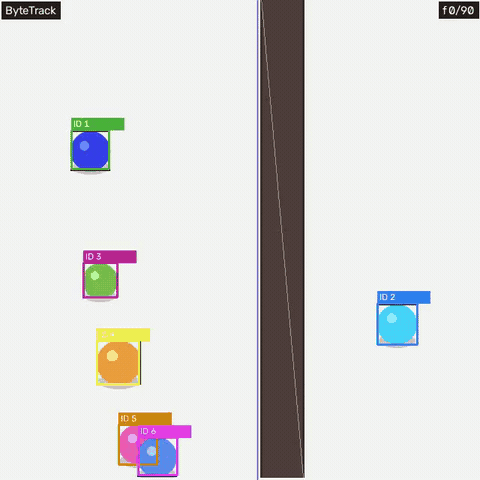 | **ByteTrack**: Two-Stage BYTE Association recovering low-confidence blurred tracks. |
| [`botsort_6obj_stress.gif`](botsort_6obj_stress.gif) | 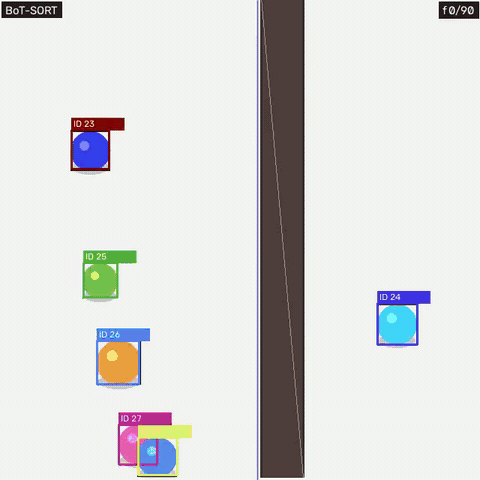 | **BoT-SORT**: ReID + Affine Camera Motion Compensation (GMC). |
| [`ocsort_6obj_stress.gif`](ocsort_6obj_stress.gif) | 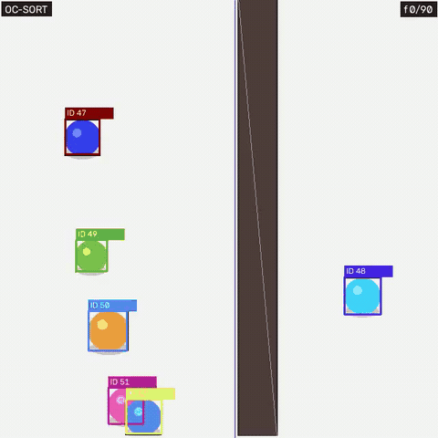 | **OC-SORT**: Observation-Centric Momentum mitigating Kalman drift during long occlusions. |
| [`deepocsort_6obj_stress.gif`](deepocsort_6obj_stress.gif) | 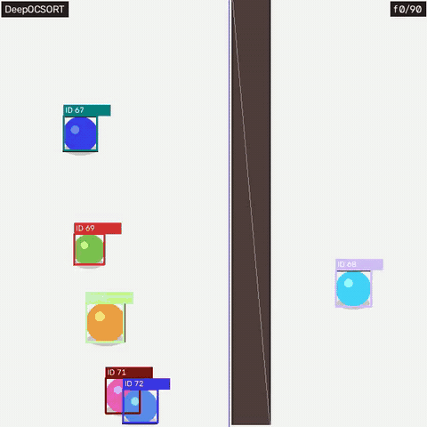 | **Deep OC-SORT**: OC-SORT combined with Deep ReID feature distance. |
| [`embed_sort_6obj_stress.gif`](embed_sort_6obj_stress.gif) | 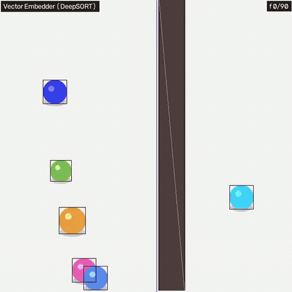 | **EmbedSORT**: Cosine appearance embeddings + Kalman filtering. |
| [`sort_6obj_stress.gif`](sort_6obj_stress.gif) |  | **SORT**: Classic Kalman filter + Hungarian IoU matching baseline. |
| [`fasttrack_6obj_stress.gif`](fasttrack_6obj_stress.gif) | 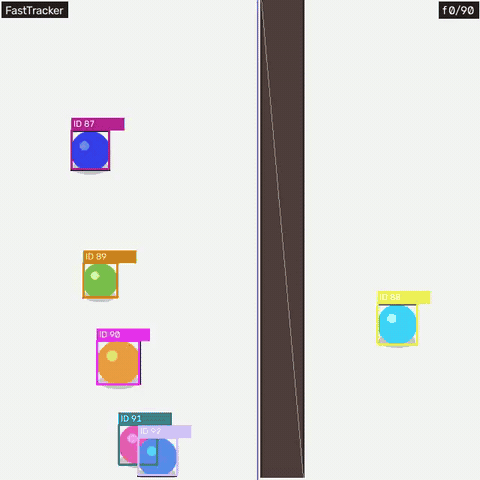 | **FastTrack**: Velocity-gated IoU association. |
| [`tracktrack_6obj_stress.gif`](tracktrack_6obj_stress.gif) | 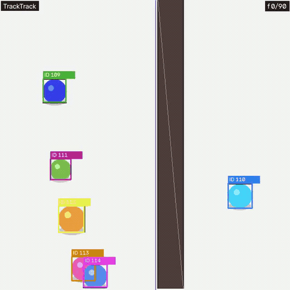 | **TrackTrack**: Multi-hypothesis cost gating. |
| [`centroid_6obj_stress.gif`](centroid_6obj_stress.gif) | 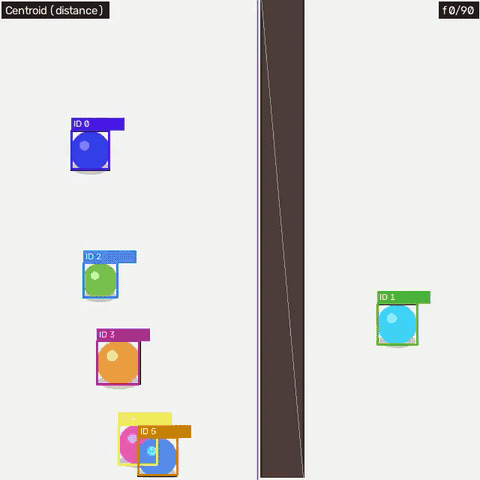 | **Centroid**: Pure Euclidean distance matching baseline. |
| [`greedy_iou_6obj_stress.gif`](greedy_iou_6obj_stress.gif) | 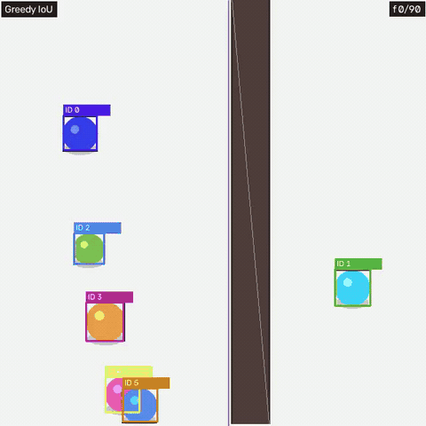 | **Greedy IoU**: Direct bounding box overlap matching baseline. |

---

## 🚶 Pedestrian Scenarios

Individual tracker recordings evaluated with pedestrian aspect ratios and walking kinematics:

| Asset | Preview | Tracker |
|---|---|---|
| [`person_bytetrack.gif`](person_bytetrack.gif) | 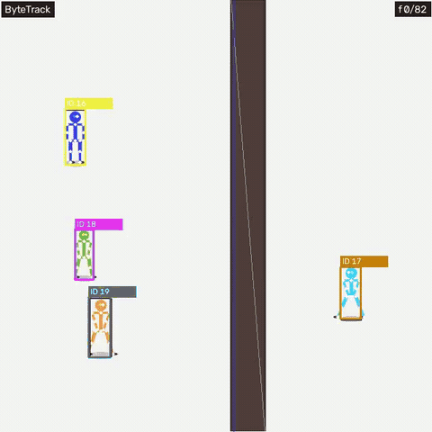 | ByteTrack |
| [`person_botsort.gif`](person_botsort.gif) | 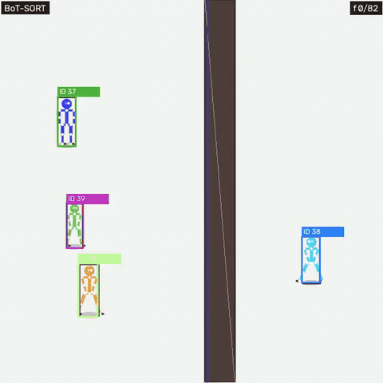 | BoT-SORT |
| [`person_ocsort.gif`](person_ocsort.gif) | 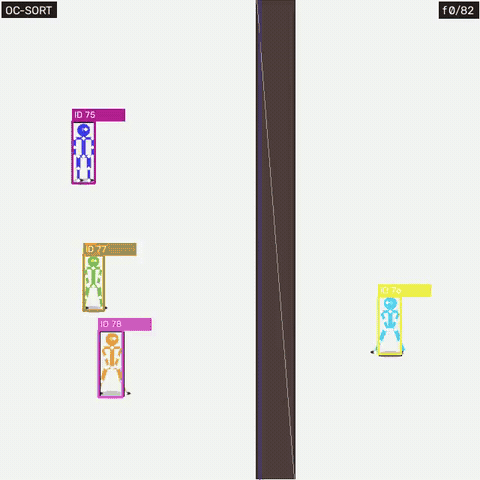 | OC-SORT |
| [`person_embed_sort.gif`](person_embed_sort.gif) | 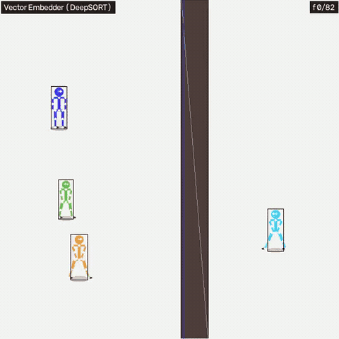 | EmbedSORT |
| [`person_sort.gif`](person_sort.gif) | 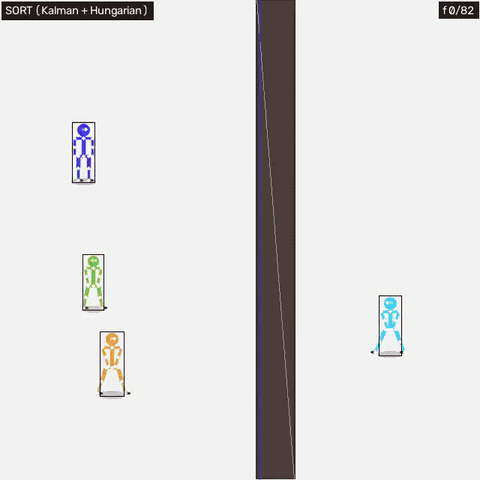 | Classic SORT |

---

## 🚗 Vehicle Scenarios

Individual tracker recordings evaluated with highway velocities and vehicle aspect ratios:

| Asset | Preview | Tracker |
|---|---|---|
| [`car_bytetrack.gif`](car_bytetrack.gif) | 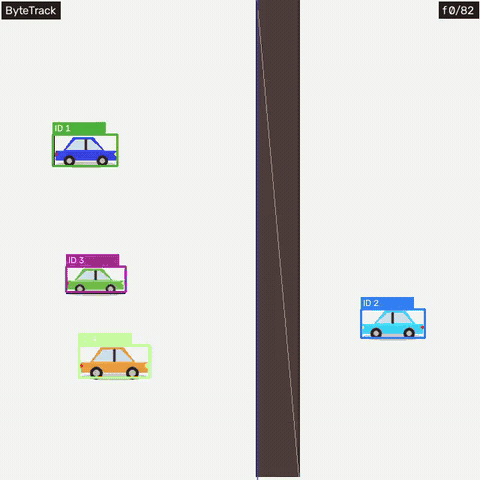 | ByteTrack |
| [`car_botsort.gif`](car_botsort.gif) | 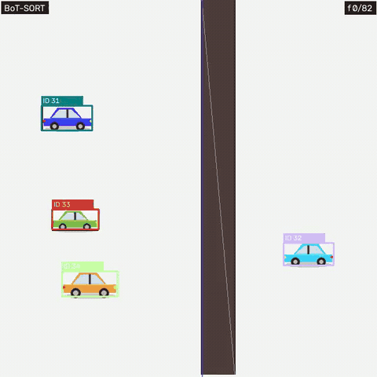 | BoT-SORT |
| [`car_ocsort.gif`](car_ocsort.gif) | 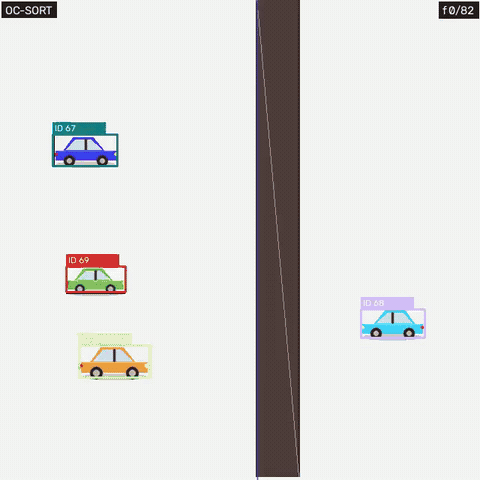 | OC-SORT |
| [`car_embed_sort.gif`](car_embed_sort.gif) | 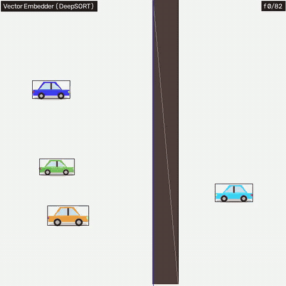 | EmbedSORT |
| [`car_sort.gif`](car_sort.gif) | 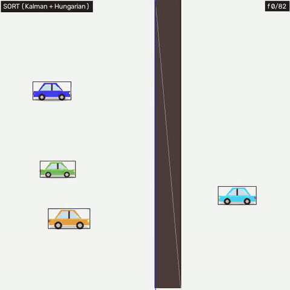 | Classic SORT |

---

## 📊 Benchmark & UI Analytics (PNG)

Diagnostic benchmark curves, decision matrices, and user interface captures:

| Asset | Preview | Description |
|---|---|---|
| [`all_trackers_tradeoff_benchmark.png`](all_trackers_tradeoff_benchmark.png) |  | **MOTA vs. IDF1 vs. ID Switches**: Full trade-off curve across all 10 MOT algorithms. |
| [`production_decision_matrix.png`](production_decision_matrix.png) |  | **Production Decision Matrix**: Latency/Throughput (FPS) vs. Accuracy tier selection. |
| [`ui_dashboard_benchmark.png`](ui_dashboard_benchmark.png) |  | **Interactive Dashboard**: Performance metrics, event timelines, and automated failure diagnosis. |
| [`ui_scenario_controls.png`](ui_scenario_controls.png) |  | **Scenario Physics Controls**: Configuration options for density, noise, and occlusion walls. |
| [`ui_simulation_radar_chart.png`](ui_simulation_radar_chart.png) | 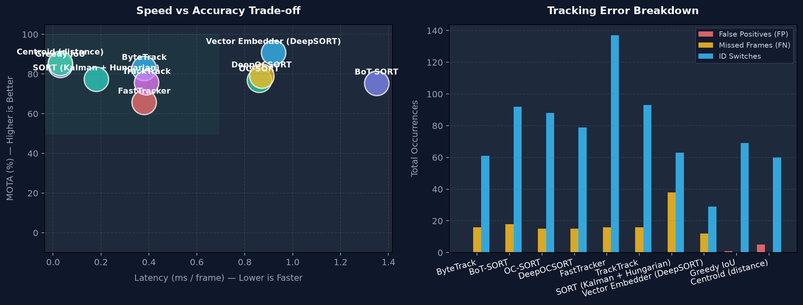 | **Simulation Radar Chart**: Multi-axis radar comparing MOTA, MOTP, IDF1, and recovery. |
